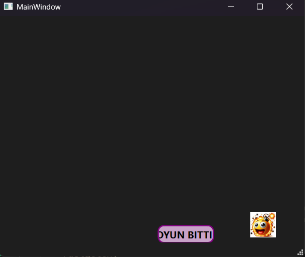

# 🏓 Bouncing Ball Game (C++ & Qt)

Bu proje, C++ ve Qt framework kullanılarak geliştirilmiş, nesne yönelimli programlama (OOP) ve temel fizik simülasyonlarına dayanan dinamik bir top sektirme (Bouncing Ball) oyunudur.

## 🚀 Özellikler

* **Hareket Fiziği ve Çarpışma Algılama:** Topun ekran sınırlarına veya rakete (buton) çarpma durumlarını hesaplayan, X ve Y eksenindeki hız vektörlerini tersine çeviren dinamik fizik algoritması.
* **Gerçek Zamanlı Kullanıcı Etkileşimi:** `QMouseEvent` (mouseMoveEvent) kullanılarak raketin kullanıcının fare hareketlerini gecikmesiz olarak takip etmesi.
* **Dinamik Pencere Boyutlandırma:** `QResizeEvent` entegrasyonu sayesinde, oyun oynanırken pencere boyutu değiştirilse bile oyun elemanlarının (top ve raket) yeni sınırlara otomatik adaptasyonu.
* **Asenkron Oyun Döngüsü:** Oyun akışının `QTimer` kullanılarak milisaniyelik periyotlarla kesintisiz güncellenmesi.
* **Oyun Sonu (Game Over) Durumu:** Top raketten kaçıp alt sınıra çarptığında oyunun durması ve arayüzün anında güncellenmesi.

## 🛠️ Kullanılan Teknolojiler

* **Dil:** C++
* **Framework:** Qt (Qt Creator)
* **Mimari:** Object-Oriented Programming (OOP), Event Handling

## 📸 Ekran Görüntüsü



## 💻 Kurulum ve Çalıştırma

Projeyi kendi bilgisayarınızda derlemek ve çalıştırmak için:

1. Bilgisayarınızda **Qt Creator** ve uygun bir C++ derleyicisi (MinGW, MSVC vb.) kurulu olmalıdır.
2. Bu depoyu (repository) bilgisayarınıza klonlayın:
```bash
   git clone [https://github.com/Benginur-Demir/GUI-Applications-CPP.git](https://github.com/Benginur-Demir/GUI-Applications-CPP.git)