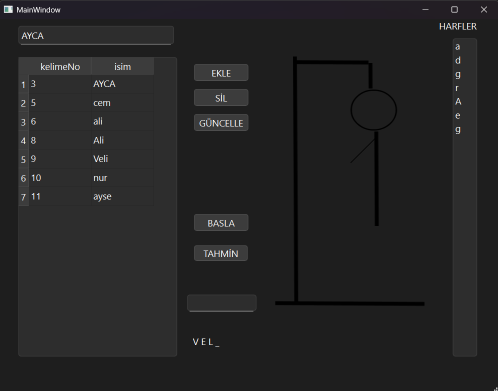

# 📝 Hangman Game with Database Integration (C++ & Qt)

Bu proje, C++ ve Qt framework kullanılarak Nesne Yönelimli Programlama (OOP) prensipleriyle geliştirilmiş masaüstü tabanlı klasik "Adam Asmaca" (Hangman) kelime tahmin oyunudur. Projenin en güçlü yönü, veri yönetimi için SQL veritabanı entegrasyonu barındırmasıdır.

## 🚀 Özellikler

* **Veritabanı Entegrasyonu:** Oyun içindeki kelime havuzunun ve oyuncu verilerinin/skorlarının SQL veritabanı üzerinden kalıcı olarak yönetilmesi.
* **Görsel Arayüz (GUI):** Kullanıcı girişlerine anında tepki veren, Qt arayüz bileşenleri ile tasarlanmış dinamik etkileşim alanı.
* **Oyun Fiziği ve Durum Kontrolü:** Hatalı tahminlerde görselin adım adım güncellenmesi ve kazanma/kaybetme durumlarının anlık kontrolü.
* **Nesne Yönelimli Tasarım:** Modüler, okunabilir ve sürdürülebilir C++ kod mimarisi.

## 🛠️ Kullanılan Teknolojiler

* **Dil:** C++
* **Framework:** Qt (Qt Creator)
* **Veritabanı:** SQL (SQLite / MySQL)
* **Mimari:** Object-Oriented Programming (OOP)

## 📸 Ekran Görüntüsü



## 💻 Kurulum ve Çalıştırma

Projeyi kendi bilgisayarınızda derlemek ve çalıştırmak için:

1. Bilgisayarınızda **Qt Creator**, uygun bir C++ derleyicisi ve ilgili SQL sürücüleri kurulu olmalıdır.
2. Bu depoyu (repository) bilgisayarınıza klonlayın:
   ```bash
   git clone [https://github.com/Benginur-Demir/GUI-Applications-CPP.git](https://github.com/Benginur-Demir/GUI-Applications-CPP.git)