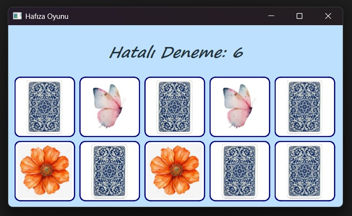

# 🃏 C++ & Qt Hafıza Oyunu (Memory Game)

Bu proje, C++ ve Qt framework kullanılarak geliştirilmiş, Nesne Yönelimli Programlama (OOP) prensiplerine dayanan masaüstü bir kart eşleştirme oyunudur.

## 🚀 Özellikler

* **Görsel Arayüz:** Qt GUI bileşenleri (QWidget, QGridLayout, QVBoxLayout) ile tasarlanmış kullanıcı dostu dinamik arayüz.
* **Özel Sınıf Yapısı:** Qt'nin `QPushButton` sınıfından kalıtım alınarak oluşturulmuş özelleştirilmiş `Etiket` (kart) sınıfı.
* **Modern C++ Standartları:** Kartların rastgele dizilimi için `std::shuffle` ve `QRandomGenerator` kullanımı.
* **Asenkron Kontrol:** Hatalı eşleşmelerde kartların geri kapanması esnasında arayüzün donmamasını sağlayan `QTimer` entegrasyonu.
* **Dinamik Skor Takibi:** Kullanıcının hatalı deneme sayısını anlık olarak ekrana yansıtan sayaç sistemi.

## 🛠️ Kullanılan Teknolojiler

* **Dil:** C++
* **Framework:** Qt (Qt Creator)
* **Mimari:** Object-Oriented Programming (OOP), Signal & Slot Mekanizması

## 📸 Ekran Görüntüsü



## 💻 Kurulum ve Çalıştırma

Projeyi kendi bilgisayarınızda derlemek ve çalıştırmak için:

1. Bilgisayarınızda **Qt Creator** ve uygun bir C++ derleyicisi (MinGW, MSVC vb.) kurulu olmalıdır.
2. Bu depoyu (repository) bilgisayarınıza klonlayın:
   ```bash
   git clone [https://github.com/KULLANICI_ADINIZ/Hafiza-Oyunu-CPP.git](https://github.com/KULLANICI_ADINIZ/Hafiza-Oyunu-CPP.git)