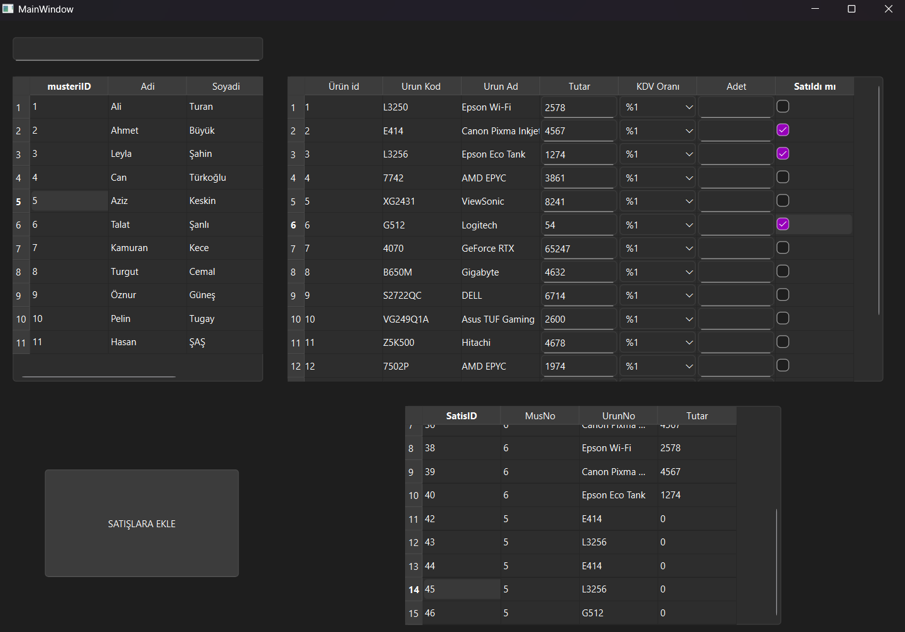

# 🛒 Sales Automation & Database Management (C++ & Qt)

Bu proje, C++ ve Qt kullanılarak geliştirilmiş, SQLite veritabanı entegrasyonu barındıran modüler bir satış otomasyonu ve veri yönetim sistemidir. 

## 🚀 Özellikler
* **Dinamik Veri İşleme:** `QSqlDatabase` ve `QSqlQuery` kullanılarak müşteriler, ürünler ve satış kayıtları üzerinde Create (Ekle) ve Read (Oku) işlemleri.
* **Etkileşimli Arayüz (GUI):** `QTableWidget` içerisine çalışma zamanında (runtime) yerleştirilmiş `QComboBox`, `QCheckBox` ve `QLineEdit` gibi dinamik arayüz elemanları.
* **Gerçek Zamanlı Hesaplama:** Kullanıcı girişlerine göre ürün miktarı ve KDV oranlarını baz alarak anında toplam satış tutarı hesaplama (Casting ve string-to-double dönüşümleri ile).
* **Canlı Arama Modülü:** Müşteri kayıtlarında anlık sorgulama (`LIKE` operatörü) ile anında sonuç getirme.

## 🛠️ Kullanılan Teknolojiler
* **Programlama Dili:** C++
* **GUI & Core Framework:** Qt 
* **Veritabanı:** SQLite
* **Mimari:** OOP, Database Abstraction, Signal/Slot Mechanism

## 📸 Ekran Görüntüsü

## 💻 Kurulum
Projeyi derlemek için C++ derleyicisi ve Qt Creator kullanılmalıdır. Ayrıca sisteminizde gerekli SQL sürücülerinin (`QSQLITE`) yapılandırılmış olması gerekmektedir. Veritabanı bağlantı yolu `mainwindow.cpp` içerisinden kendi sisteminize göre güncellenmelidir.